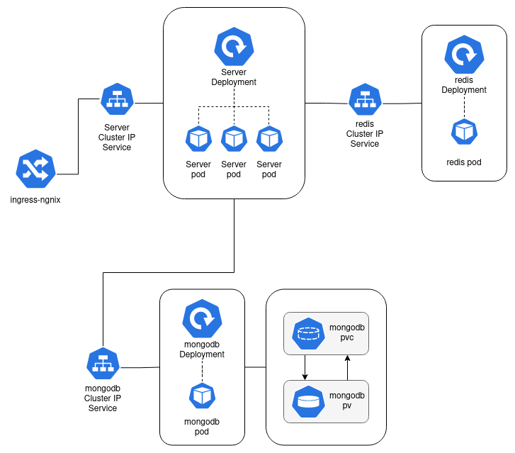

# k8s & nodejs application

This is a nodejs application deployed with kubernetes to the minikube cluster.



## Instructions

before running this application make sure that `docker`, `minikube` and `kubectl` are installed on your local system.

1. Create `mongodbpassword` and `sessionsecret` k8s `secret` using `kubectl create` command.

```
$ kubectl create secret generic mongodbpassword --from-literal MONGO_PASSWORD=<your password>

$ kubectl create secret generic sessionsecret --from-literal SESSION_SECRET=<session secret>
```

2. Create k8s resources (deployments, service, etc.) using `kubectl`

execute command in given order to avoid connection errors.

- Create resources for `mongo` database service. 
```
$ kubectl apply -f k8sConfigs/mongodb-pvc.yaml
$ kubectl apply -f k8sConfigs/mongo-deployment.yaml
$ kubectl apply -f k8sConfigs/mongo-cluster-ip-service.yaml
```
- Create `redis` database resources
```
$ kubectl apply -f k8sConfigs/redis-deployment.yaml
$ kubectl apply -f k8sConfigs/redis-cluster-ip-service.yaml
```
- Create nodejs server resources
```
$ kubectl apply -f k8sConfigs/server-deployment.yaml
$ kubectl apply -f k8sConfigs/server-cluster-ip-service.yaml
```

Creating ingress-nginx service requires additional steps to follow. All the information related to ingress nginx and installation steps can be found [here](https://github.com/kubernetes/ingress-nginx/)

on `minikube` ingress-controller can be installed by executing command

```
$ minikube addons enable ingress
```
- Create ingress-service by applying config
```
$ kubectl apply -f k8sConfigs/ingress-service.yaml
```
After successful creation of all the k8s resources we can test our application using `minikube ip`.
- Get minikube ip by executing command

```
$ minikube ip
```
- make a requires to our application.
```
$ curl <minikube_ip>/api/
```
